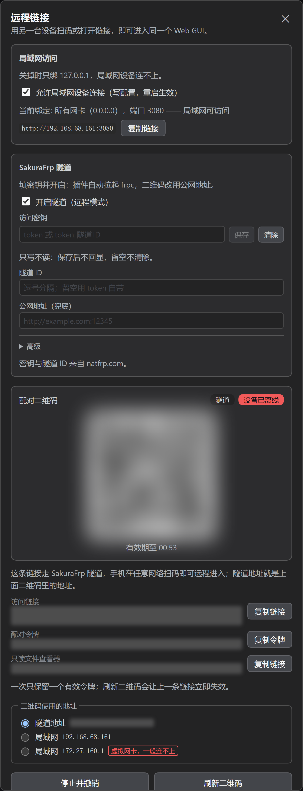

# dsh-remote-link

在电脑上运行 dsh web 后，手机扫码即可进入同一界面。外网访问由随包的 frpc 连到 SakuraFrp 服务端，局域网内直接连接。已配对的设备再次打开链接时无需重新扫码。



## 使用方法

### 安装

将插件装入 web profile：

```powershell
dsh plugin --profile web add --config.auto-install-peers=false <插件目录>
```

也可直接从 GitHub 安装：

```powershell
dsh plugin --profile web add --config.auto-install-peers=false github:Loki-0228/dsh-remote-link
```

`--config.auto-install-peers=false` 不可省略。缺少该参数时，pnpm 会到 registry 解析宿主侧仅有预发布版本的依赖，随后中止。安装完成后重启 dsh web。

卸载插件：

```powershell
dsh plugin --profile web remove @loki-0228/dsh-remote-link
```

### 扫码配对

入口位于侧边栏「工作区」标题右侧的图标组中，是最左侧的链接图标。


打开面板后，用手机扫描二维码，或将配对链接发送到手机上打开。手机端进入的是官方界面，会话与设置均可正常使用。

二维码设有有效期，过期后点击面板中的「刷新二维码」重新生成。同一时间仅保留一个有效令牌，刷新后上一条链接立即失效。已配对的设备无需再次扫码，直接打开原地址即可进入。

### 从外网访问

在外网访问本机时，需要为 dsh web 提供一个公网地址，插件通过 SakuraFrp 隧道完成这一步。

1. 在面板的「SakuraFrp 隧道」区域勾选「开启隧道（远程模式）」。
2. 填写「访问密钥」，密钥在 natfrp.com 获取。可只填 token，也可写成 `token:隧道ID` 的形式。
3. 「隧道 ID」留空则使用密钥自带的配置，也可单独填写。
4. 点击「保存」。插件将启动 frpc，从日志中解析到公网地址后，二维码即改用该地址，手机在移动网络下也可扫描。

访问密钥只写不读，保存后不回显。留空不会清除已保存的密钥，删除需点击「清除」。隧道客户端 frpc 已随插件打包，无需另行安装。

### 仅在局域网内使用

不开隧道时，同一局域网内也可连接。在面板的「局域网访问」区域勾选「允许局域网设备连接」。开启后 dsh web 会监听所有网卡，面板上会列出局域网地址，点击「复制链接」发送到手机即可打开。

该开关修改后需重启 dsh web 才会生效，面板会给出提示。Windows 防火墙未放行 3080 端口时，面板同样会给出提示。

### 在手机上查看文件

若只需查看项目文件，不必打开完整界面，可使用面板中的「只读文件查看器」。配对二维码卡片上提供了该链接，复制后发送到手机即可。该页面仅支持查看，不能修改或删除文件。打开时默认定位到当前正在使用的项目目录。

### 修改设置

隧道、局域网、令牌有效期等均在面板中修改。直接编辑文件时，相关设置位于 `$DSH_HOME/settings.yaml` 的 `remote-link` 段。

从手机或其它设备打开的面板为只读，修改设置请在电脑上操作。

## iPad 应用与通知接口

iPad 版提供横竖屏远程会话、通知摘要、审批和通知类型设置。安装未签名 IPA 与配置 APNs 的步骤见 [iPad 安装说明](ios/README.md)。

其他插件的通知调用方式、移动设备的 HTTP 接口见 [通知接口参考](docs/notification-api.md)。

## 技术说明

插件是一个包，由一行插件（`cordis.patch.yml`）挂载两面。宿主进程运行 `lib/index.js`，浏览器运行 `lib/client.js`。

- 配对以一次性令牌换取设备凭据，设备可在面板中逐个撤销。
- `/remote` 是受控通道。已配对设备的 `/api`、`/sidebar`、`/git` 请求与事件流，由宿主以 127.0.0.1 的身份转回本机。
- `/api/pair`、`/api/update`、`/api/plugin-manager` 只接受本机请求。
- 只读查看器的路由族只有 GET，请求路径必须相对根目录，根与目标都过 `fs.realpath`，单文件上限 1 MB。
- 配对设备刷新 `/` 时由插件发出外壳，未携带凭据的访客仍得到官方 401。
- 局域网开关向 profile 的 `cordis.patch.yml` 写入托管块，下次启动生效。
- frpc 随包提供，默认路径由 `import.meta.url` 推导，可用 `frpcPath` 或环境变量 `DSH_REMOTE_LINK_FRPC` 覆盖。
- 设置位于 `remote-link` 命名空间，`frpcToken` 按 secret 脱敏。
- 包内无运行时依赖，`lib/` 产物已提交到仓库。

## 许可

以 Apache-2.0 许可发布。仓库地址见 <https://github.com/Loki-0228/dsh-remote-link>。
